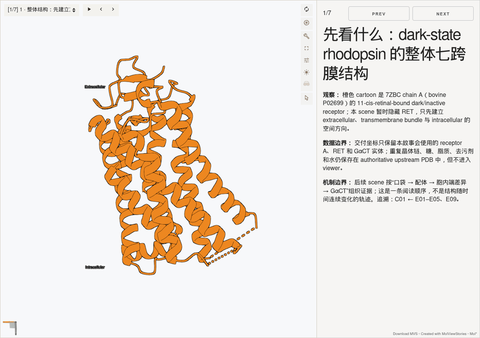
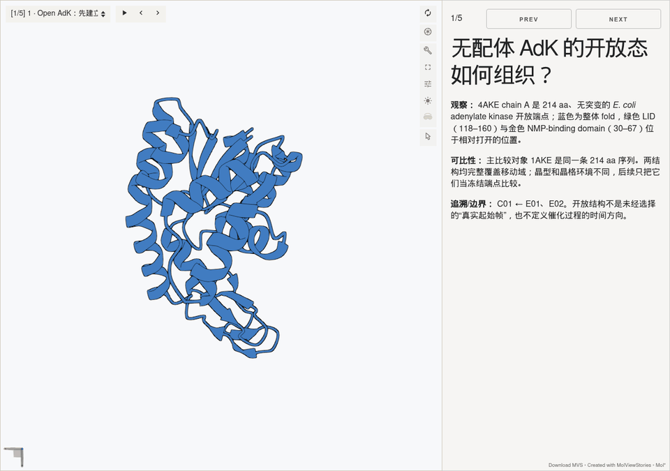
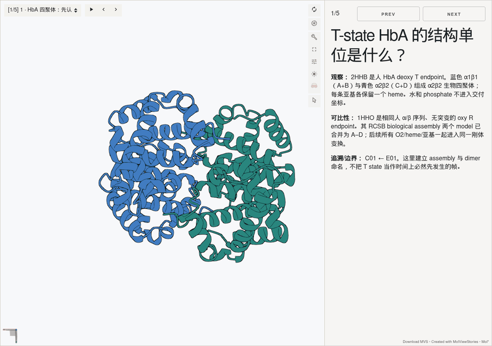
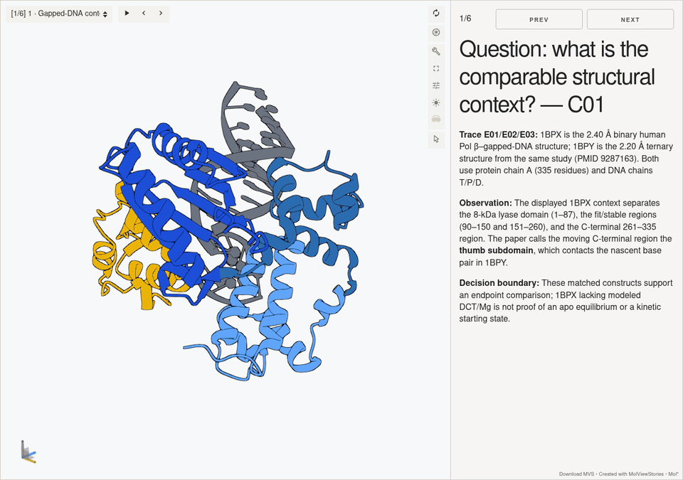
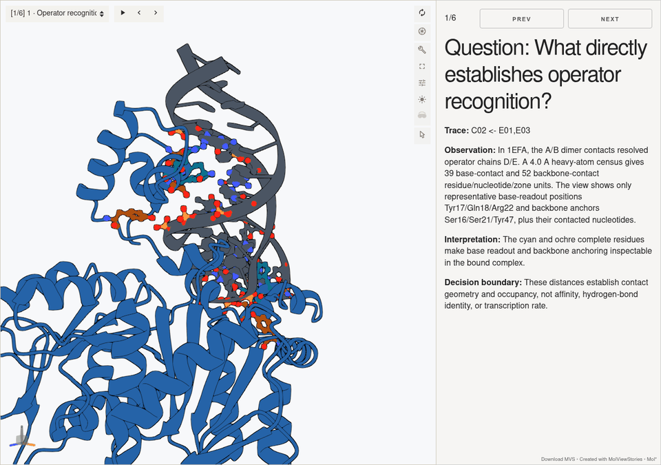
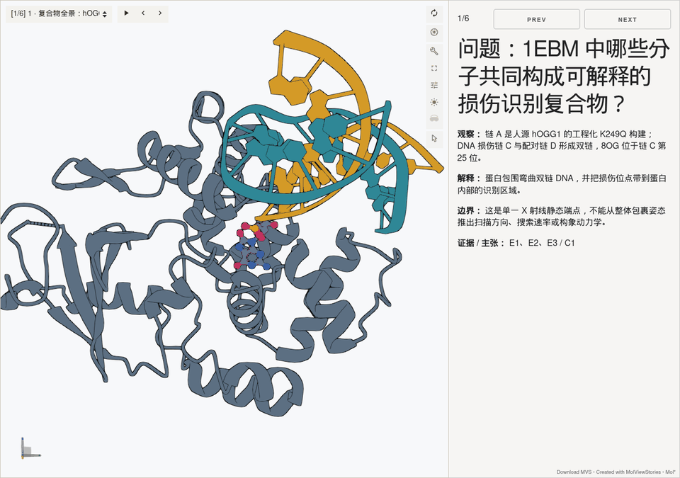
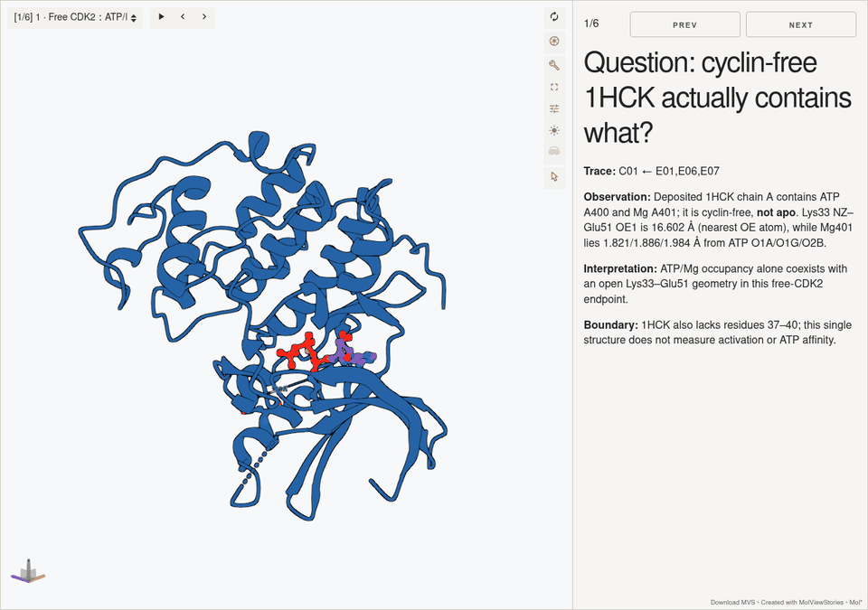
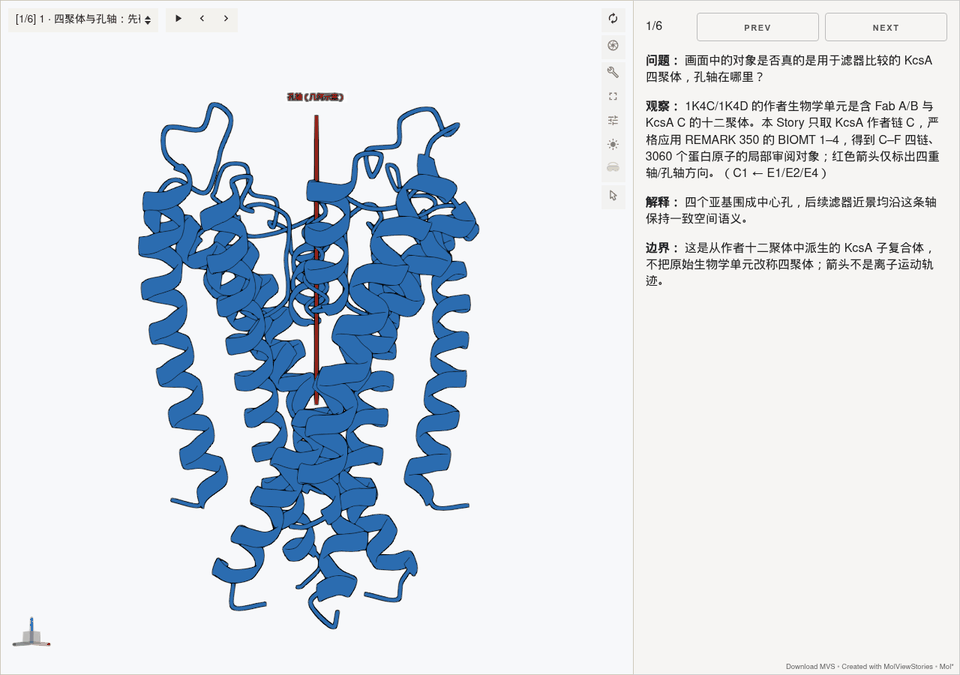

# Mol* Story mechanism showcases

These examples were generated with the `molstar-story` skill in this pull
request. Each GIF cycles through settled, browser-accepted Story scenes; it is
a compact review preview, **not** an interpolation of atomic coordinates or a
molecular trajectory.

## Rhodopsin: retinal pocket to transducin-tail accommodation

- **Evidence:** dark retinal-bound [7ZBC](https://www.rcsb.org/structure/7ZBC),
  ligand-free active [3CAP](https://www.rcsb.org/structure/3CAP), and the
  GαCT-bound active complex [3DQB](https://www.rcsb.org/structure/3DQB).
- **Computed result:** after a 129-Cα receptor-core fit, E247 and T251 differ by
  9.534 and 7.335 Å. The observed GαCT pose has no heavy-atom pair below 2.0 Å
  in 3DQB, whereas substituting the aligned dark receptor produces 99 such
  pairs across eight receptor residues.
- **Bounded conclusion:** the active-like intracellular cavity geometrically
  accommodates the observed GαCT pose; the unchanged dark endpoint does not.
  The structures do not prove that retinal alone causes the path or that the
  measured displacement is sufficient for full G-protein activation.

## Adenylate kinase: AP5A and LID/NMP closure

- **Evidence:** unligated open [4AKE](https://www.rcsb.org/structure/4AKE) and
  AP5A-bound closed [1AKE](https://www.rcsb.org/structure/1AKE), the same
  unmutated 214-residue *E. coli* adenylate kinase sequence.
- **Computed result:** a 133-Cα core fit gives 1.551 Å RMSD. LID mean
  displacement is 13.623 Å (T149: 23.955 Å); NMP mean displacement is 9.505 Å
  (A55: 18.464 Å). Fixing the observed AP5 pose against the open endpoint
  produces 16 heavy-atom overlaps below 2.0 Å, versus none in the closed
  endpoint under the same altloc rule.
- **Bounded conclusion:** the closed endpoint accommodates the observed AP5
  pose, while the unchanged open endpoint cannot retain it. The pair does not
  establish a physical closure pathway, catalytic rate, or free-energy gain.

## Hemoglobin: oxygen-site geometry to the T/R switch

- **Evidence:** human HbA deoxy-T [2HHB](https://www.rcsb.org/structure/2HHB)
  and the biological oxy-R tetramer from
  [1HHO](https://www.rcsb.org/structure/1HHO).
- **Computed result:** fitting the α1β1 dimer over 287 Cα atoms gives 0.936 Å
  RMSD; the partner α2β2 dimer differs by a 13.005° relative rotation. The
  α-heme Fe-to-porphyrin-N-plane distance changes from 0.448 Å (deoxy) to
  0.121 Å (oxy), and β2 His97 changes its α1 switch-neighborhood geometry.
- **Bounded conclusion:** local heme, quaternary, and α1β2-switch differences
  form a traceable T/R endpoint evidence chain. Two structures cannot derive a
  Hill coefficient, T/R populations, cooperative free energy, or causal order.

## Textbook mechanisms for non-experts

The next five examples broaden the portfolio from conformational comparison to
DNA synthesis and repair, transcriptional control, protein phosphorylation, and
ion-channel recognition. Each Story follows the supported event order and makes
unsupported causal edges visible.

### DNA polymerase beta: nucleotide analogue to closed synthesis geometry

- **Evidence:** binary human Pol beta-gapped DNA
  [1BPX](https://www.rcsb.org/structure/1BPX) and the same study's ddCTP
  analogue ternary endpoint [1BPY](https://www.rcsb.org/structure/1BPY).
- **Computed result:** a 170-C-alpha fit over residues 91-260 gives 0.573 A
  RMSD. Residues 261-335 differ by 5.064 A on average and Helix N by 6.913 A;
  the two Mg ions contact ddCTP/Asp190/Asp192/Asp256 at 1.939-2.628 A.
- **Bounded conclusion:** the ternary analogue endpoint is closed around a
  Watson-Crick-compatible nascent pair. Two endpoints do not prove the physical
  closure route, normal-dNTP behavior, kinetics, thermodynamics, or quantitative
  fidelity.

### Lac repressor: operator recognition to inducer-linked derepression

- **Evidence:** operator/anti-inducer-bound [1EFA](https://www.rcsb.org/structure/1EFA),
  IPTG-bound [1LBH](https://www.rcsb.org/structure/1LBH), and independent
  operator-fragment binding measurements from
  [Horton et al.](https://doi.org/10.1006/jmbi.1996.0706).
- **Computed result:** the selected dimers fit over 338 C-alpha atoms at
  1.037 A RMSD; the N-terminal core differs by about 6.34-6.44 degrees. The
  operator endpoint contains 39 base-contact and 52 backbone-contact units.
- **Limited conclusion:** operator and ONPF/IPTG pocket geometries are directly
  inspectable, and the reported assay links IPTG to reduced operator
  interaction. The structural core-to-DNA-binding-head edge remains unresolved
  because 1LBH lacks residues 1-61; no DBD displacement is fabricated.

### hOGG1: oxidized-base extrusion into a recognition pocket

- **Evidence:** the human hOGG1 K249Q-DNA-8OG capture complex
  [1EBM](https://www.rcsb.org/structure/1EBM).
- **Computed result:** the local C1-prime bend angle is 76.15 degrees; extruded
  8OG contacts His270, Gly42, Gln315, and Phe319 at 2.758-3.186 A. The 4.0 A
  shell contains 76 atom pairs across 15 protein residues.
- **Bounded conclusion:** extrusion geometrically sequesters the lesion in the
  recognition pocket. The K249Q endpoint does not establish lesion-search or
  extrusion dynamics, wild-type excision chemistry, kinetics, or product
  release.

### CDK2: cyclin docking to phospho-T160 anchoring

- **Evidence:** cyclin-free ATP/Mg-bound [1HCK](https://www.rcsb.org/structure/1HCK),
  cyclin-A-bound [1FIN](https://www.rcsb.org/structure/1FIN), phosphorylated
  [1JST](https://www.rcsb.org/structure/1JST), and the corresponding activation
  studies.
- **Computed result:** stable C-lobe fits are 0.656/0.649 A. Lys33-Glu51 closes
  from 16.602 to 3.066 A; TPO160 contacts Arg50/Arg126/Arg150 at
  2.668/2.672/2.838 A. The 1FIN cyclin interface contains 222 atom pairs at a
  4.0 A cutoff.
- **Bounded conclusion:** cyclin docking, local ATP-compatible geometry, and a
  three-Arg phospho-T160 anchor form an inspectable evidence chain. The three
  non-isomorphic structures do not encode a continuous activation trajectory or
  a unique causal order.

### KcsA: a carbonyl cage for potassium

- **Evidence:** high- and low-potassium KcsA-Fab structures
  [1K4C](https://www.rcsb.org/structure/1K4C) and
  [1K4D](https://www.rcsb.org/structure/1K4D); the delivery coordinates derive
  the four-chain KcsA subcomplex and omit the unconsumed Fab.
- **Computed result:** a 392-C-alpha non-filter fit gives 0.3585 A RMSD, while
  the TVGYG backbone differs by 1.1532 A. High-K S1-S4 positions lie
  2.688-2.940 A from the nearest carbonyl oxygen; low-K coordinates retain two
  deposited sites.
- **Bounded conclusion:** the TVGYG carbonyl cages geometrically accommodate the
  deposited K+ positions. These static high/low concentration endpoints do not
  derive selectivity thermodynamics, flux, a knock-on sequence, or gating.

### Candidate rejected by the performance gate

Cas9 target recognition was scientifically prepared and pruned to one 4ZT0
Cas9-sgRNA copy plus one 4UN3 target complex. The pinned build succeeded, but
the network-blocked viewer still did not expose its scene selector within 60
seconds. It therefore has no GIF and is not counted as an accepted showcase.

## Acceptance

All 47 scenes across the eight accepted Stories passed offline `file://` checks with
WebGL2, live camera convergence, stable post-representation canvas digests,
rotate/zoom/pick interaction, and no console, page, failed-request, or external
network errors. Decision-bearing scenes were also inspected manually. The
Stories use pruned presentation coordinates, opaque decision-relevant views,
and the lightweight illustrative rendering defaults described by the skill.
