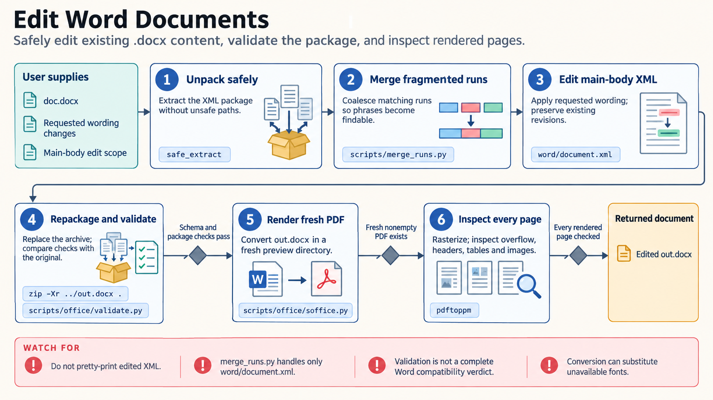

[All skill guides](README.md) / Word Document Creation and Editing

# Word Document Creation and Editing

**Create and revise research documents with structured formatting and visual checks.**

The DOCX skill helps a research assistant create Word documents, fill templates, edit existing content, inspect revisions, and add comments. It combines document-generation tools with careful handling of the underlying Word package. For scientists, it is useful for reports, methods documents, collaborator drafts, and other deliverables where editable text, tables, figures, and review history matter.

*Research content or an existing template is assembled, edited, rendered, and reviewed as an editable Word document. [View the full-size workflow diagram](../images/docx.png).*

## Questions this skill can help you explore

- **Can I turn this material into a polished report?** Organize headings, figures, tables, and document navigation.
- **Can I revise a collaborator’s draft transparently?** Preserve existing revisions and apply requested tracked changes or comments.
- **Will the document actually look correct?** Render pages and inspect the layout before delivery.

## What you bring

Bring the content, figures, tables, references, and intended audience, or an existing DOCX/DOTX template to preserve. State required sections, page settings, branding, and review conventions. For editing, identify the requested scope and whether changes should be tracked, commented, or incorporated into a clean copy.

## How the workflow works

1. **Choose the document route.** Use structured generation for new files, template patching for placeholders, or package-aware editing for existing content.
2. **Preserve document semantics.** Apply actual headings, paragraphs, table structures, images, and relationships rather than relying on visual spacing alone.
3. **Make the requested edits.** Respect existing revision history and inspect relevant headers, footers, notes, and text boxes when the scope spans the whole document.
4. **Validate structure and revisions.** Check the package and, where applicable, compare tracked edits with the original text.
5. **Render and inspect every page.** Review overflow, table breaks, figure placement, headers, fonts, and the final editable artifact.

## What you get

| Output | What it helps you do |
| --- | --- |
| Editable DOCX document | Continue drafting and collaboration in a word processor. |
| Tracked changes or anchored comments | Review the requested revisions in context. |
| Rendered page previews and check findings | Assess actual layout rather than assuming generation succeeded. |

## Example request

> Use the DOCX skill to turn this methods text, results table, and supplied figures into an editable research report using my template. Preserve the heading styles, add clear captions and page numbers, and render every page for inspection. Return the Word file with any unresolved layout or source-content issues identified.

*This is an illustrative request, not a reported research result.*

## Interpreting the results

**Formatting checks do not verify scientific claims.** Source accuracy, statistical interpretation, and citation support remain separate review tasks. A document can be structurally valid while containing a misleading table or unsupported statement.

Converters may substitute fonts or handle revisions differently from Word. The validator is a practical compatibility check, not a guarantee for every Word feature. Track-change checks also have scope limits, so rendered review and attention to non-body content remain necessary.

## Get started

The documented toolchain includes Node.js with docx, Python 3.11+ with defusedxml and lxml, and LibreOffice, Pandoc, and Poppler for conversion and visual inspection. Local processing needs no credentials; installation needs network access. The bundled skill’s license terms govern its underlying files.

[Setup and technical instructions](../../skills/docx/SKILL.md)
