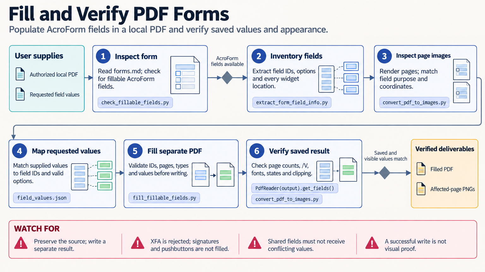

[All skill guides](README.md) / PDF Processing

# PDF Processing

**Extract, assemble, or create research PDFs and verify the rendered result.**

This skill helps a research assistant work with PDF files: extract text and tables, merge or split documents, rotate pages, create reports, fill forms, and use OCR when pages contain scanned text. It brings together task-specific Python libraries and command-line tools.

For scientists, it is useful for preparing document packets, recovering tables for careful review, or generating a readable report. The workflow preserves the original and checks both the saved structure and the visible page layout.

*From a source PDF and defined document task to extraction or editing, reopened-file checks, rendered-page inspection, and a verified deliverable.
[View the full-size workflow diagram](../images/pdf.png).*

## Questions this skill can help you explore

- **Can I recover useful text or tables from this document?** Choose direct extraction or OCR according to the page content.
- **Can I prepare a clear document packet?** Combine, split, rotate, or annotate selected pages.
- **Did the edit preserve the intended appearance and values?** Inspect affected pages rather than relying on extracted text alone.

## What you bring

Provide the original PDF, the exact pages or fields involved, and the desired output. State whether the file is scanned, password-protected, signed, or an interactive form. For table extraction, identify the variables and units of interest; for new documents, provide the text, figures, page requirements, and any fonts or branding that must be preserved.

## How it works

1. **Inspect the document and task.** Determine whether the operation concerns text, page structure, images, interactive fields, or a new layout.
2. **Choose appropriate tools.** Use task-specific extraction, editing, rendering, or OCR components rather than assuming one library handles every feature.
3. **Process a separate output.** Preserve the source and retain page provenance for extracted material.
4. **Reopen and check structure.** Verify page counts, field values, extracted content, and expected files.
5. **Render and inspect.** Examine every changed page for clipping, missing glyphs, form appearance, placement, and scientific notation before delivery.

## What you get

| Output | What it helps you do |
| --- | --- |
| Edited or assembled PDF | Distribute the requested document or page collection. |
| Extracted text or tables | Prepare material for review and subsequent analysis. |
| OCR text for scanned pages | Make selected scanned content searchable. |
| Rendered review pages | Inspect the actual visible result and identify layout defects. |

## Example request

> Use the PDF skill to assemble the supplied methods pages and figures into a single review packet. Preserve the originals, verify page order and counts, and render every changed page to check labels, equations, and clipping. Extract the specified results table separately with page provenance and flag uncertain minus signs, units, or merged cells.

*This is an illustrative research request, not a reported result.*

## Interpreting the results

**Text extraction is not visual validation.** A PDF can contain correct extracted text while displaying broken fonts, clipped labels, or empty form appearances. Scientific tables need checks of decimal separators, minus signs, superscripts, units, and cell relationships before numerical analysis.

OCR can introduce plausible transcription errors, especially in equations and low-resolution scans. Interactive fields, static overlays, XFA forms, and signatures require different handling. Keep the source document as the authoritative reference for extraction and editing decisions.

## Get started

The documented examples use Python 3.12+ and selected packages such as pypdf, pdfplumber, ReportLab, or pdf2image. Poppler is needed for relevant rendering workflows and Tesseract with language data for OCR. Other CLI or JavaScript paths have optional dependencies. Local processing requires no API credentials.

[Setup and technical instructions](../../skills/pdf/SKILL.md)
