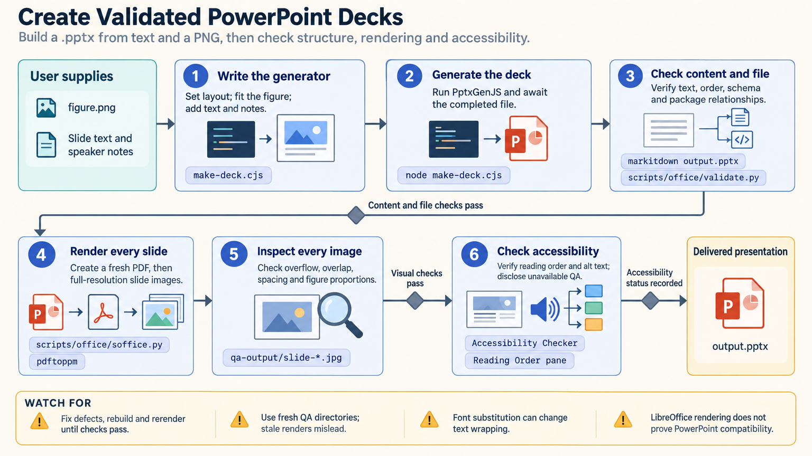

[All skill guides](README.md) / PowerPoint Presentations

# PowerPoint Presentations

**Create and revise editable presentation files while checking both slide content and rendered appearance.**

The PPTX skill helps an assistant read, create, edit, and validate PowerPoint presentations and templates. For research communication, it supports assembling supplied findings into slides, adapting an existing layout, preserving editable elements, and inspecting the finished deck. It combines file-structure checks with visual review so that a technically readable file also communicates clearly.

*Review the scientific content, editable slide structure, and final visual presentation together. [View the full-size workflow diagram](../images/pptx.png).*

## Questions this skill can help you explore

- **How can I turn these results into a deck?** Create slides from a defined audience, narrative, figures, and source material.
- **Can I adapt an existing template?** Reuse appropriate layouts while preserving formatting, notes, and embedded relationships.
- **Is the presentation ready to review?** Check slide structure and inspect rendered pages for clipping, legibility, and visual errors.

## What you bring

Provide the audience, purpose, desired slide count or speaking time, and the claims the presentation should support. Supply figures, data, citations, and any required template or branding. For edits, identify the source deck and the exact content or layout changes, including requirements for editable charts and speaker notes.

## How it works

1. **Inspect the source and plan the story.** Read existing content and thumbnail views when a template is involved, then map the requested material to suitable layouts.
2. **Create or adapt the slides.** Build a new deck or edit the existing package while preserving relationships between slides, charts, media, and notes.
3. **Check scientific content.** Review units, labels, uncertainty, citations, and consistency with the supplied evidence.
4. **Validate file structure.** Check package relationships and slide or chart defects, using the source template as a baseline where appropriate.
5. **Render and inspect.** Review every slide visually, fix overflow or distorted figures, and check that leftover template content is removed.

## What you get

| Output | What it helps you do |
| --- | --- |
| Editable presentation or template file | Share and continue revising the research presentation. |
| Rendered slides or thumbnail grids | Review the visual sequence, readability, and layout. |
| Content and structural findings | Locate issues before the deck is used or distributed. |

## Example request

> Use the PPTX skill to adapt my laboratory's template for a research update. Use the supplied figures and verified findings, preserve editable elements where practical, and add speaker notes for the methods. Check labels, citations, slide relationships, and rendered appearance, then provide the revised deck for review.

*This is an illustrative request, not a reported research result.*

## Interpreting the results

**Presentation formatting does not validate the underlying research.** Claims, uncertainty, and comparisons must remain faithful to the supplied evidence. Visual emphasis or simplified charts must not change the scientific meaning.

A structurally valid file can still have unreadable text or application-specific rendering differences. Shared chart parts and embedded objects also require care when duplicating slides. Native PowerPoint behavior, animations, and accessibility may need checks in the target application.

## Get started

The workflow uses Python 3.10+, Node.js, and task-specific presentation packages such as PptxGenJS. Visual rendering requires LibreOffice and Poppler. Local editing needs no service credentials, while installing dependencies or obtaining linked media may require network access.

[Setup and technical instructions](../../skills/pptx/SKILL.md)
