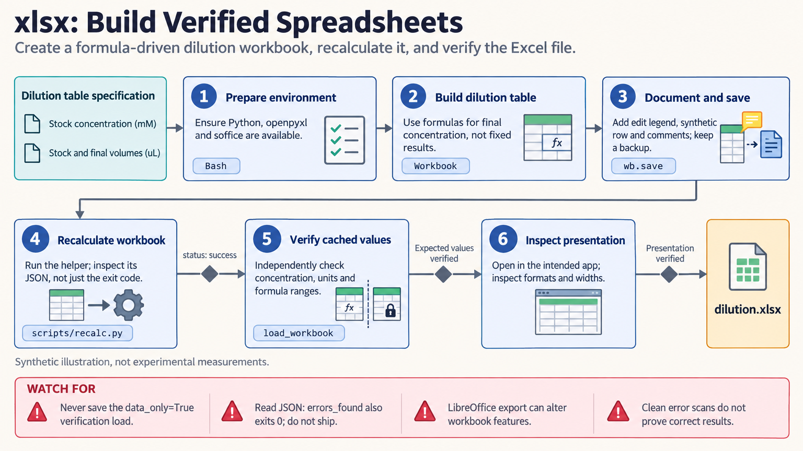

[All skill guides](README.md) / Excel Spreadsheets

# Excel Spreadsheets

**Create and revise research workbooks whose formulas, assumptions, and presentation can be inspected.**

The XLSX skill supports spreadsheet files as the main deliverable: structured tables, formulas, formatting, multiple sheets, and conversions to Excel. It helps an assistant preserve an existing workbook's conventions or build a new one with clear inputs and outputs. Recalculation and independent value checks are central because writing a formula into a file does not calculate its result.

*Review formulas and displayed results together before handing over a research workbook. [View the full-size workflow diagram](../images/xlsx.png).*

## Questions this skill can help you explore

- **Can these measurements become a usable workbook?** Organize supplied data with clear headers, units, input cells, and computed summaries.
- **Can I update an existing model without breaking it?** Preserve designated inputs, formulas, styles, and workbook structure while making the requested changes.
- **Do the saved results actually recalculate?** Check formula caches, errors, ranges, and representative values in a spreadsheet engine.

## What you bring

Provide the source data or workbook, desired sheet names and columns, calculation definitions, units, and formatting requirements. Identify which cells are inputs and which formulas must be preserved. Supply assumptions and sources for fixed values, and flag external links, macros, controls, or other application-specific features.

## How it works

1. **Inspect structure and intent.** Read formulas and stored values as distinct views and identify existing workbook conventions.
2. **Make the requested changes.** Use editable formulas for calculations, preserve designated input areas, and document assumptions where readers can find them.
3. **Recalculate a working copy.** Use a compatible spreadsheet engine rather than assuming a file-editing library evaluates formulas.
4. **Check results independently.** Inspect errors, expected values, units, totals, formula ranges, and intended array outputs.
5. **Review the presentation.** Check number formats, widths, charts, print areas, and any differences introduced by recalculation before delivery.

## What you get

| Output | What it helps you do |
| --- | --- |
| An editable Excel workbook | Continue entering data and recalculating the defined analysis. |
| Recalculation and error findings | Locate formula or compatibility issues in the saved file. |
| Visible assumptions and source notes | Understand where constants, inputs, and calculations came from. |

## Example request

> Use the XLSX skill to organize my assay measurements into the requested workbook structure. Preserve the sample identifiers and units, use formulas for the specified summaries, and document all fixed assumptions. Recalculate a working copy, verify representative results independently, and inspect formatting and charts before handing over the file.

*This is an illustrative request, not a reported research result.*

## Interpreting the results

**No formula errors does not mean the calculations are scientifically correct.** Wrong ranges, units, denominators, or assumptions can produce plausible values. Cached results can also be absent or stale even when formulas are present.

Recalculation in another spreadsheet application can alter formatting or unsupported features. External links, custom functions, macros, and dynamic arrays may need native Excel checks. This file-authoring workflow does not validate a statistical method simply because it is expressed in a spreadsheet.

## Get started

The documented workflow requires Python 3.10+ and openpyxl, with LibreOffice for the bundled recalculation route. Pandas and MarkItDown are optional extraction tools. Local file work needs no service credentials; installation may require network access, and protected Excel-specific features may require a compatible native workflow.

[Setup and technical instructions](../../skills/xlsx/SKILL.md)
